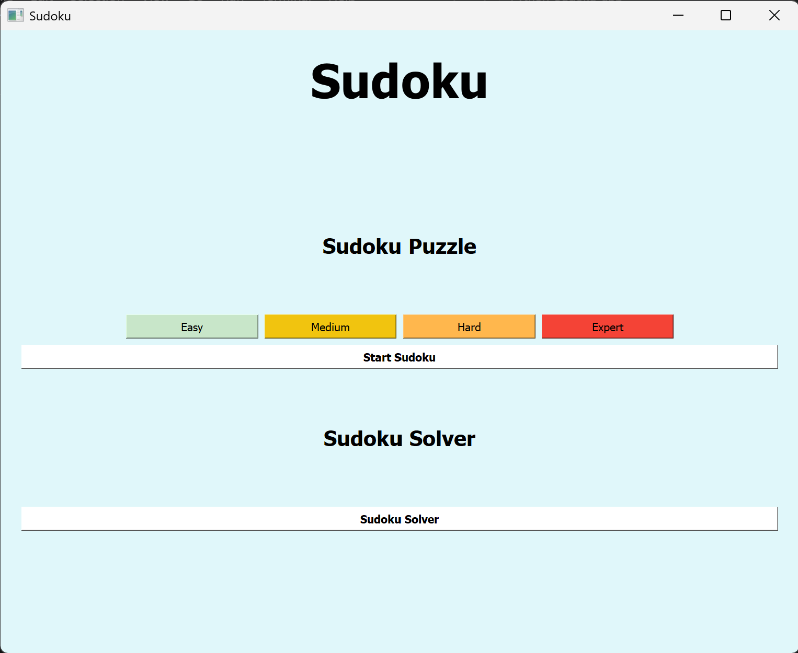
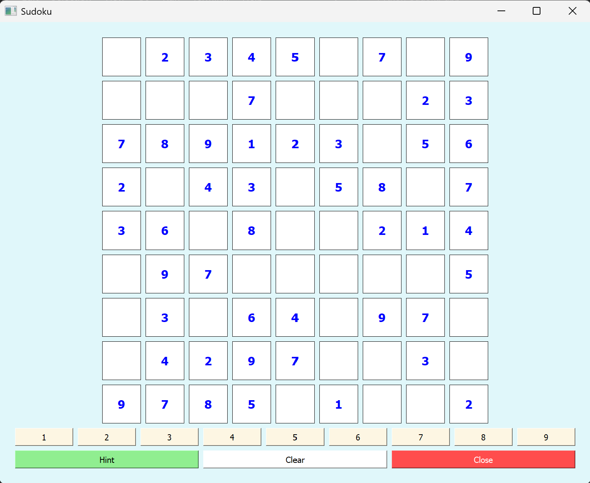
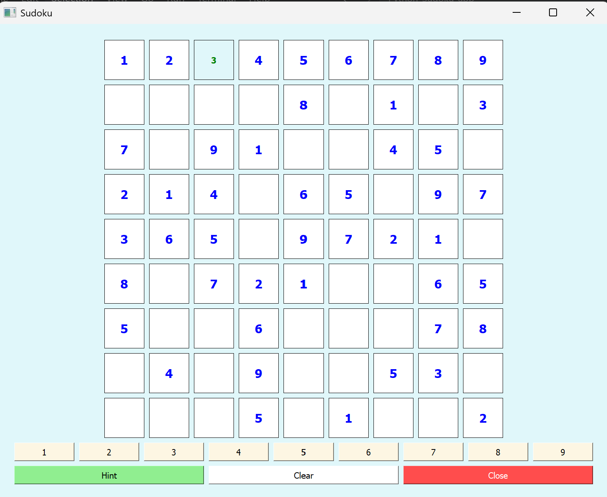
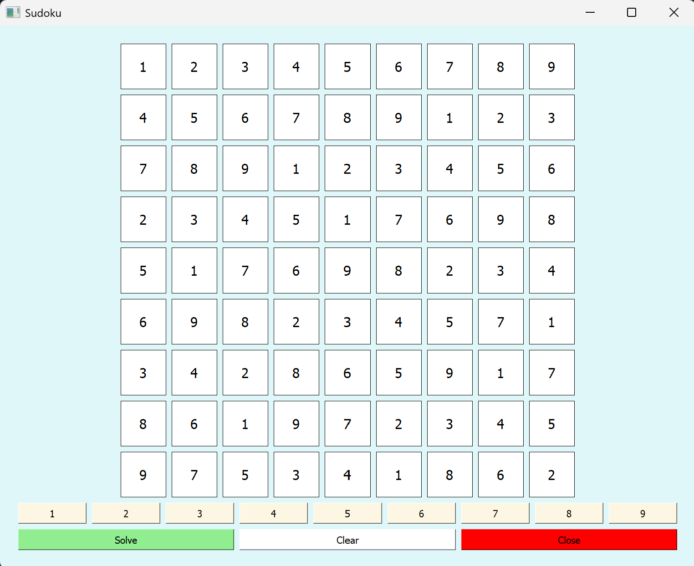
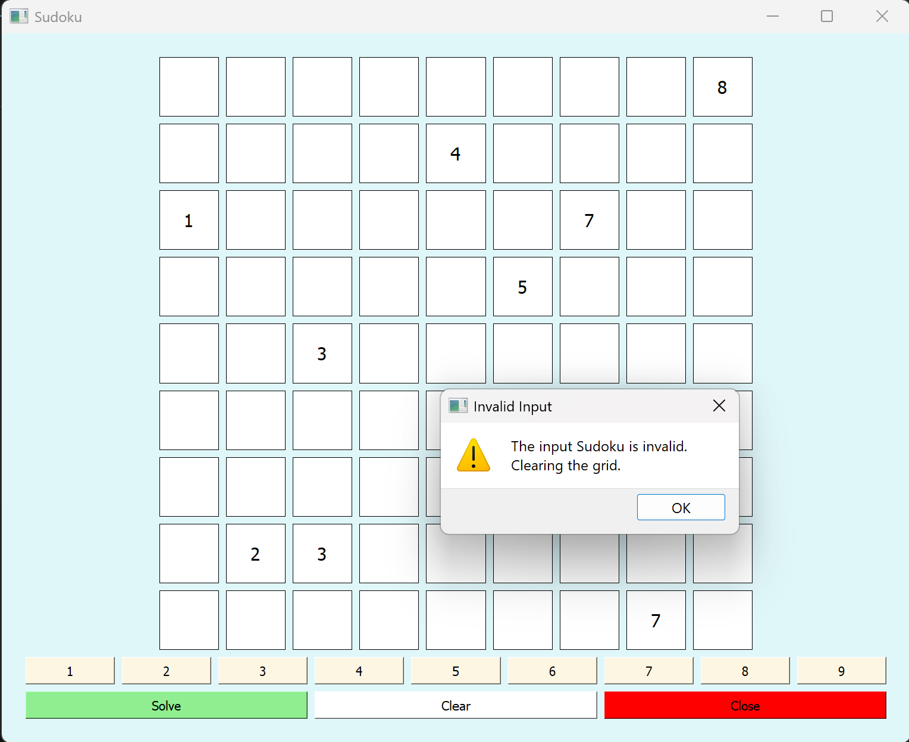

# 🧩 Sudoku Generator & Solver

<p align="center">

**A modern Sudoku Generator and Solver built using Python & PyQt5**

Generate Sudoku puzzles with multiple difficulty levels or solve your own custom puzzles using a fast Backtracking Algorithm.

</p>

---

## ✨ Features

✅ Generate Sudoku Puzzles

- 🟢 Easy
- 🟡 Medium
- 🟠 Hard
- 🔴 Expert

✅ Sudoku Solver

- Solve any valid Sudoku puzzle
- Detect invalid puzzles
- Clear invalid inputs automatically

✅ User Friendly Interface

- 🎮 Number pad input
- 💡 Hint system
- 🧹 Clear button
- 📍 Row & Column highlighting
- 📖 Separate Puzzle Generator and Solver pages

---

## 🛠 Technologies Used

| Technology | Purpose |
|------------|---------|
| 🐍 Python | Programming Language |
| 🖥 PyQt5 | GUI Development |
| 🧠 Backtracking | Sudoku Generation & Solving |

---

# ⚙️ Code Overview

| Function | Description |
|----------|-------------|
| `generate_sudoku()` | Generates Sudoku puzzles based on difficulty |
| `generate_full_solution()` | Creates a complete Sudoku solution |
| `solve()` | Solves Sudoku using Backtracking |
| `is_valid()` | Checks whether a move is valid |
| `is_grid_valid()` | Validates user input before solving |
| `give_hint()` | Fills one correct number |
| `clear_grid()` | Clears user-entered values |
| `create_sudoku_page()` | Creates Puzzle Generator UI |
| `create_blank_page()` | Creates Sudoku Solver UI |

---

# 🚀 Installation

### 1️⃣ Clone the Repository

```bash
git clone https://github.com/AnveshsShetty/Sudoku-PyQt5.git
```

### 2️⃣ Open the Project

```bash
cd Sudoku-PyQt5
```

### 3️⃣ Create a Virtual Environment

**Windows**

```bash
python -m venv venv
```

**Linux / macOS**

```bash
python3 -m venv venv
```

---

# ▶️ Activate the Virtual Environment

### Windows

```bash
venv\Scripts\activate
```

### Linux / macOS

```bash
source venv/bin/activate
```

If activated successfully, you'll see

```text
(venv)
```

---

# 📦 Install Dependencies

```bash
pip install -r requirements.txt
```

or

```bash
pip install PyQt5
```

---

# ▶️ Run the Application

```bash
python main.py
```

---

# 🧠 How the Solver Works

The application uses the **Backtracking Algorithm**.

```
Find Empty Cell
       │
       ▼
Try Number (1-9)
       │
       ▼
Valid?
 ┌─────┴─────┐
 │           │
No          Yes
 │           │
 ▼           ▼
Next Number  Place Number
                 │
                 ▼
        Solve Remaining Cells
                 │
                 ▼
        Backtrack if Needed
```

---

# 📸 Screenshots

## 🏠 Home Page



---

## 🎮 Sudoku Generator



---

## 🧩 Hint Generator



---

## ✅ Sudoku Solver



## Invalid Input


---

# 🚀 Future Improvements

- 🌙 Dark Mode
- ⏱ Timer
- 🏆 Score Tracking
- 💾 Save & Load Puzzle
- 🎯 Unique Puzzle Generation
- ⌨ Keyboard Shortcuts
- 🔊 Sound Effects
- 📱 Responsive UI

---

# 👨‍💻 Author

### **Anvesh Shetty**

**Electronics & Communication Engineering**

**Python • PyQt5 • VLSI • Embedded Systems**

---

⭐ **If you found this project useful, consider giving it a star on GitHub!**
